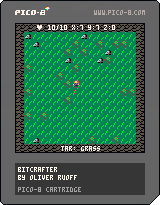

# BitCrafter
BitCrafter is a Pico-8 game which is about exploring, surviving and building. (And to learn LUA)

## Development

- The development for this only just started, there are a lot of things to learn, like:
    - Lua (programming language)
    - Rendering for pico-8
    - Pixel Art
    - Sound design
    - Map design
    - ...
- It will be a side project to my other projects, if I want to only code and relax a little bit :)

## Features 

- This is a collection of ideas for features in the game:
    - Crafting
    - Entering different floors -> Stairs to go up and down
    - Live Coordinates 
    - Map that can be toggled (Maybe can be crafted, or as menu)
    - Day / Night time?
    - Lightning? Do you need to light up rooms?
    - Mining

## Changelog

### 2023-02-04
- Added initial player sprites

